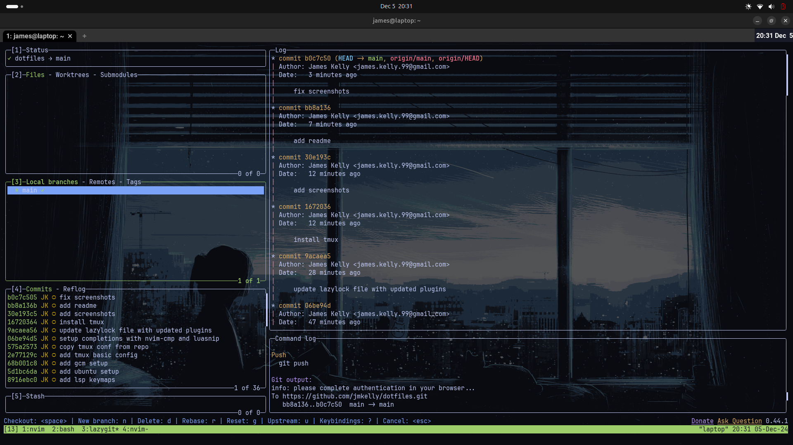
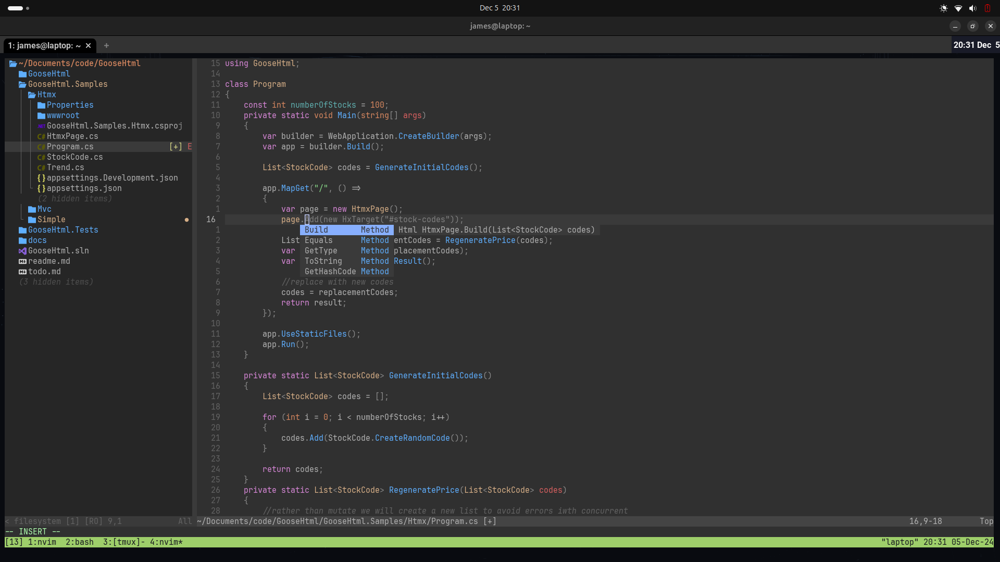

# My Ubuntu 24.04 dev setup 

My setup is primary for my C# development. Could be adjusted for any dev with tweaks to the neovim config

## Install

On a clean ubuntu 24.04 install

```
git clone https://github.com/jamesmccarthy/dotfiles.git
cd dotfiles
./setup.sh
```

## Apps

- wezterm 
- lazygit
- neovim
- git credential manager
- tmux
- dotnet-8-sdk

## Screenshots







